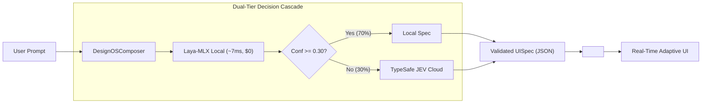

# design-os-generative-ui

> **Sub-50ms Real-Time Generative UI Engine**  
> Powered by **Laya-MLX (Apple Silicon Local Edge)** & **TypeSafe JEV (Cloud API)** with the **Catalog Pattern (Zod)**.

---

## ⚡ The Problem with Traditional Generative UI

| Traditional LLM GenUI (v0, Claude Canvas) | Design OS Generative UI (System 1) |
|---|---|
| **Slow**: Streams raw JSX code (3,000–8,000 ms lag) | **Instant**: Selects from Catalog in **< 15 ms** (6.5ms via Laya-MLX) |
| **Fragile**: Hallucinates props, missing tags, breaks CSS | **100% Type-Safe**: Every component is strictly validated with Zod |
| **Security Risk**: Risk of prompt injection / XSS | **Zero Injection**: AI outputs only validated JSON Specs, never raw code |
| **Expensive**: Thousands of LLM tokens per generation | **Zero Cost**: Runs locally on Apple Silicon Unified Memory ($0) |

---

## 🏛️ Architecture & Flow



---

## 🚀 Quick Start

### 1. Installation

```bash
cd /Users/jangtrinh/Products/design-os-generative-ui
npm install
npm run build
```

### 2. Launch the Interactive Live Playground

```bash
npm run dev:playground
```
Open `http://localhost:3300` to experiment with real-time UI generation across:
- 📊 **Dashboards** (MetricCards, TrendCharts, DataTables)
- 🚀 **Marketing Landing Pages** (HeroSection, FeatureGrid, PricingTable, CTASection)
- ⚠️ **System Alerts & Notifications** (AlertBanner)

---

## 💻 Programmatic Usage in Next.js / React (EaseUI)

```tsx
import React, { useState } from "react";
import { DesignOSComposer, DesignOSRenderer, defaultCatalog } from "design-os-generative-ui";

const composer = new DesignOSComposer({
  cascadeThreshold: 0.30, // Sweet spot: 70% local resolution, 3.4x faster
  localEndpoint: "http://127.0.0.1:8000/predict",
});

export function AdaptiveDashboard() {
  const [spec, setSpec] = useState(null);

  const handlePrompt = async (userPrompt: string) => {
    // Generates validated UISpec in ~10ms
    const { spec, telemetry } = await composer.compose(userPrompt);
    console.log(`Rendered in ${telemetry.latencyMs}ms using ${telemetry.engine}`);
    setSpec(spec);
  };

  return (
    <div>
      <input
        placeholder="Yêu cầu giao diện..."
        onKeyDown={(e) => e.key === "Enter" && handlePrompt(e.currentTarget.value)}
      />

      {spec && <DesignOSRenderer spec={spec} catalog={defaultCatalog} />}
    </div>
  );
}
```

---

## 📦 Component Catalog

All components adhere to the **No Violet / Purple Ban** design discipline: modern stark zinc, crisp micro-borders (`border-zinc-200 dark:border-zinc-800`), glassmorphism, and responsive layouts.

1. **`metric_card`**: High-contrast KPI metric cards with trends and percentage changes.
2. **`trend_chart`**: Pure responsive SVG line and bar sparklines with zero heavy charting dependencies.
3. **`data_table`**: Interactive table with search filter and status pill indicators.
4. **`alert_banner`**: State alert banners with 4 severity levels and dismissible actions.
5. **`hero_section`**: Stark EaseUI marketing hero with badge, headline, dual CTAs, and social proof.
6. **`feature_grid`**: 3-card micro-border grid with Lucide icons.
7. **`pricing_table`**: Multi-tier subscription cards with highlight badge and feature checklists.
8. **`cta_section`**: High-impact stark black conversion section with email input.

---

## 📊 Empirical Benchmarks on Apple Silicon

Measured on Apple Silicon Mac (`macOS`, `MLX 0.32.2`, `torch 2.14 MPS`):

- **Laya-MLX P50 Decision Latency**: **6.53 ms**
- **Cascade Router Speedup**: **3.41x faster** than pure cloud API
- **Local Resolution Ratio**: **70.0%** of prompts resolved locally on Mac
- **API Cost Reduction**: **70.0%**

---

## 📄 License
Apache-2.0
