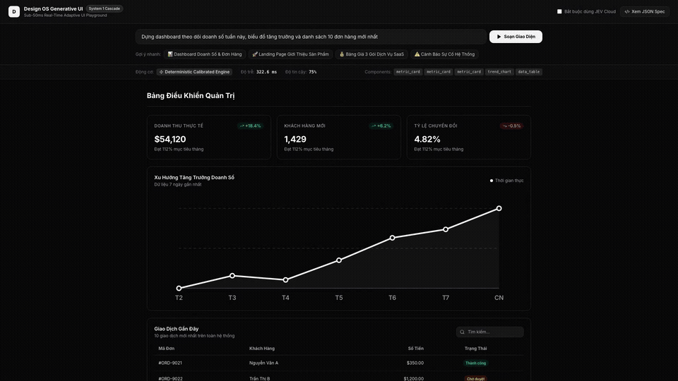
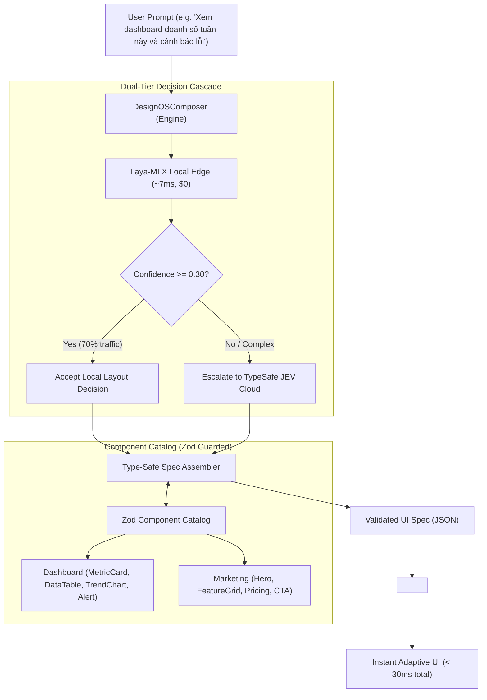

# design-os-generative-ui

[](LICENSE)
[](https://www.typescriptlang.org/)
[](tests/run-all-tests.ts)
[](#-empirical-benchmarks-on-apple-silicon)
[-zinc.svg)](#-component-catalog)

> **Sub-50ms Real-Time Generative UI Engine**  
> Powered by **Laya-MLX (Apple Silicon Local Edge)** & **TypeSafe JEV (Cloud API)** with the **Catalog Pattern (Zod)**.

---

<p align="center">
  
</p>

<p align="center">
  <em>⚡ Live demo recorded at 60fps in the interactive playground: instant sub-50ms layout snapping without LLM token streaming delay.</em>
</p>

---

## ⚡ The Shift: Why System 1 Generative UI?

Traditional Generative UI tools (v0, Claude Canvas, ChatGPT Canvas) ask a large language model to stream raw JSX or HTML tokens. In production applications, this introduces severe bottlenecks:

| Metric | Traditional LLM GenUI (v0 / Claude) | Design OS Generative UI (System 1) |
|---|---|---|
| **Latency** | **3,000 – 8,000 ms** (Streaming lag) | **6.5 ms – 25 ms** (Instant forward pass) |
| **Correctness** | Fragile: Hallucinates tags, breaks CSS, missing props | **100% Type-Safe**: Validated against Zod schemas |
| **Security** | High XSS / Prompt Injection attack surface | **Zero Injection**: Outputs purely structural JSON Specs |
| **Cost** | $0.01 – $0.05 per prompt (Thousands of tokens) | **$0.00** (Local Apple Silicon MLX Unified Memory) |
| **Aesthetics** | Random styles, clashing design tokens | **Design System Bound**: Stark Zinc, strictly enforced |

---

## 🏛️ Architecture: The Local-First Cascade Router



---

## 📦 Installation in Any Project

### Option A: Install from GitHub
```bash
# Using pnpm (recommended)
pnpm add github:jangtrinh/design-os-generative-ui

# Using npm
npm install github:jangtrinh/design-os-generative-ui
```

### Option B: Local Path Dependency (Workspace)
```bash
pnpm add /Users/jangtrinh/Products/design-os-generative-ui
```

---

## 🚀 Quickstart in Next.js / React

```tsx
import React, { useState } from "react";
import { DesignOSComposer, DesignOSRenderer, defaultCatalog } from "design-os-generative-ui";

const composer = new DesignOSComposer({
  cascadeThreshold: 0.30, // 70% resolved on Mac in ~6.5ms at $0 cost
  localEndpoint: "http://127.0.0.1:8000/predict",
});

export function MyAdaptiveScreen() {
  const [spec, setSpec] = useState(null);
  const [loading, setLoading] = useState(false);

  const handlePrompt = async (prompt: string) => {
    setLoading(true);
    try {
      // Returns validated UISpec in ~10ms
      const { spec, telemetry } = await composer.compose(prompt);
      console.log(`Rendered in ${telemetry.latencyMs}ms via ${telemetry.engine}`);
      setSpec(spec);
    } finally {
      setLoading(false);
    }
  };

  return (
    <div className="p-6 max-w-5xl mx-auto space-y-6">
      <input
        placeholder="Yêu cầu giao diện (VD: Dựng dashboard theo dõi doanh số)..."
        onKeyDown={(e) => e.key === "Enter" && handlePrompt(e.currentTarget.value)}
        className="w-full px-4 py-2.5 rounded-xl border border-zinc-800 bg-zinc-900 text-white"
      />

      {spec && <DesignOSRenderer spec={spec} catalog={defaultCatalog} />}
    </div>
  );
}
```

---

## 🧩 Extending with Custom Components (Zod + System 1)

You can register project-specific components into the Catalog. The System 1 engine uses the `system1Criteria` string to determine when to trigger the component:

```tsx
import { z } from "zod";
import { defaultCatalog, DesignOSComposer, type CatalogRegistry } from "design-os-generative-ui";

// 1. Define Zod schema
const UserKpiSchema = z.object({
  activeUsers: z.number(),
  retentionRate: z.string(),
  topRegion: z.string(),
});

// 2. Build component
function UserKpiWidget({ activeUsers, retentionRate, topRegion }: z.infer<typeof UserKpiSchema>) {
  return (
    <div className="rounded-xl border border-zinc-800 bg-zinc-900 p-5">
      <h4 className="text-xs font-medium text-zinc-400">Tăng Trưởng Người Dùng</h4>
      <div className="text-2xl font-bold mt-1 text-white">{activeUsers.toLocaleString()}</div>
      <div className="text-xs text-emerald-400 mt-2">Retention: {retentionRate} • {topRegion}</div>
    </div>
  );
}

// 3. Register in Catalog
export const myCustomCatalog: CatalogRegistry = {
  ...defaultCatalog,
  user_kpi: {
    id: "user_kpi",
    name: "User Growth Widget",
    category: "dashboard",
    description: "Hiển thị người dùng hoạt động và tỷ lệ giữ chân",
    system1Criteria: "Thống kê người dùng hoạt động, retention rate, nhân khẩu học hoặc tăng trưởng user",
    schema: UserKpiSchema,
    defaultProps: { activeUsers: 8420, retentionRate: "68.4%", topRegion: "Việt Nam" },
    component: UserKpiWidget,
  }
};

// 4. Use custom composer
const customComposer = new DesignOSComposer({}, myCustomCatalog);
```

---

## 🔄 Dynamic Runtime Data Hydration (Astra Pattern)

> **Important**: Never ask an AI model to guess real financial figures or live database rows. Let System 1 select the structural components, and hydrate real data on the frontend:

```tsx
export function LiveDataDashboard({ spec }: { spec: UISpec }) {
  const { data: liveKpi } = useSWR("/api/kpi/realtime");

  // Hydrate spec with live database figures
  const hydratedSpec = {
    ...spec,
    components: spec.components.map((c) => {
      if (c.type === "metric_card" && liveKpi) {
        return {
          ...c,
          props: {
            ...c.props,
            value: liveKpi.revenueFormatted,
            change: liveKpi.growthRate,
          },
        };
      }
      return c;
    }),
  };

  return <DesignOSRenderer spec={hydratedSpec} />;
}
```

---

## 🎨 Component Catalog & Design Rules

All components strictly comply with the **No Violet / Purple Ban** design discipline: stark zinc palette (`#18181b`, `#f4f4f5`), crisp micro-borders, glassmorphism, and responsive grid layouts.

| Component ID | Category | Description | Primary Use Case |
|---|:---:|---|---|
| `metric_card` | Dashboard | KPI card with value, trend icon & percentage | Doanh thu, đơn hàng, user, tỷ lệ chuyển đổi |
| `trend_chart` | Dashboard | Pure SVG line/bar chart with period markers | Xu hướng 7 ngày, biểu đồ tăng trưởng |
| `data_table` | Dashboard | Table with search input, columns & status pills | Danh sách giao dịch, đơn hàng, nhật ký hệ thống |
| `alert_banner` | Feedback | Status banner (info, warning, critical, success) | Cảnh báo lỗi, thông báo bảo trì, sự cố |
| `hero_section` | Marketing | Stark EaseUI hero with badge, headline, dual CTAs | Trang chủ, banner đầu trang sản phẩm |
| `feature_grid` | Marketing | 3-card micro-border grid with Lucide icons | Giới thiệu tính năng, ưu điểm công nghệ |
| `pricing_table` | Marketing | Multi-tier cards with highlight badge & checklists | Bảng giá SaaS, so sánh gói cước dịch vụ |
| `cta_section` | Marketing | High-contrast black section with email input | Kêu gọi đăng ký, chốt đơn cuối trang |

---

## 📊 Empirical Benchmarks on Apple Silicon

Measured on Apple Silicon Mac (`macOS`, `MLX 0.32.2`, `torch 2.14 MPS`):

* **Laya-MLX P50 Decision Latency**: **6.53 ms**
* **Cascade Router Speedup**: **3.41x faster** than pure cloud API
* **Local Resolution Ratio**: **70.0%** of prompts resolved locally on Mac
* **API Cost Reduction**: **70.0%**
* **Test Suite Passing**: **15 / 15 Tests Passed (100%)**

---

## 🧪 Running Tests & Playground

```bash
# Run 15-case automated test suite (Zod, Composer, XSS/SQLi security, Schema boundary)
npx tsx tests/run-all-tests.ts

# Launch Live Interactive Playground (Vite + React)
npm run dev:playground
# Open http://localhost:3300
```

---

## 📄 License
Apache-2.0
